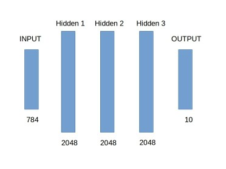

**Note: This is still an ongoing project, major changes and results are expected in the near future**
 
# Binary Neural Networks
An attempt to recreate neural networks where the weights and activations are binary variables. This is a common underlying theme of the papers [BinaryConnect](https://arxiv.org/abs/1511.00363), [Binarized neural networks](https://arxiv.org/abs/1602.02830) and [XNOR-Net](https://arxiv.org/abs/1603.05279). The goal is to free these high performing deep learning models from the shackles of a supercomputer (read: GPUs) and bring them to edge devices which typically have a much lower memory footprint and limited computation capabilities. 

### Requirements 
1. Theano (0.9.0 or higher)
2. Python 2.7
3. numpy 
4. tqdm (awesome progbars)
5. tensorboard (logging data)

### Idea
1. Regularization: Binarization of weights is a form of noise for the system. Hence just like dropout, binarization can act as a regularizer. 
2. Discretization is a form of corruption, we can make discretization errors in different weights but the randomness of this curroption cancels out these errors. 
3. Perform forward and backward pass using binarized form of weights, however keep a second set of weights (using full precision fp32) for gradient update. This is because SGD makes infinitesimal changes that would be lost due to binarization. Hence during forward pass one can sample a set of binary weights from full precision weights. 
4. Deterministic binarization: Wb = +1.0 if W >=0 ; else -1.0. 
5. Stochastic binarization: (TODO)
6. Clip weights if they exceed +1/-1 as they do not contribute to the network due to the binarization.  

### Experiment 1: MNIST
In this experiment a baseline and binarized version of a standard MLP is trained on the MNIST dataset. In order to have a fair comparison between the two networks, the data is not augmented and dropout is applied to the baseline network to give it a fair chance against the binary network (as the binarization acts as a regularizer). The learning rate is set at a constant 0.001 and both networks are trained for 200 epochs with a batch size of 256. The training loss and validation accuracy is visualized in tensorboard using [this gist](https://gist.github.com/gyglim/1f8dfb1b5c82627ae3efcfbbadb9f514). The basic architecture is as follows:
 

#### Results
**1. Baseline**

<!-- [Training Loss](readme_data/baseline_loss.png "Training Loss")  !-->
Test accuracy: 0.9687   

**2. Binarized** 

<!--   -->
Test accuracy: 0.9372 

### Experiment 2: CIFAR 10
(TODO)

#### Results
(TODO)

### Why?
This work is a result of my curiosity to understand computation problems that arise with the deployment of neural networks. I am fascinated by some recent works that have come up with effective ways to compress, prune and quantize deep networks so that they run on small embedded devices. This is a (tiny) step in that direction.    

